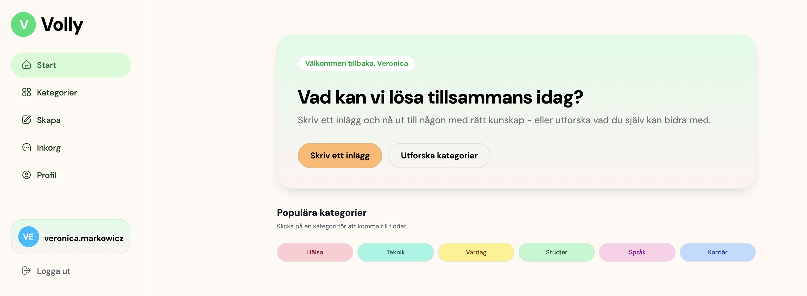

# Volly

### Skapad av Zero Bug Heroes

https://volly-staging.cc.k3s.chas-lab.dev/

Volly är en volontär app som kopplar ihop människor som behöver hjälp med vardagliga sysslor med människor som vill hjälpa till.
Man ska kunna skapa inlägg där man antingen ber om hjälp eller erbjuder sig hjälpa andra. Det kan va allt från vanliga vardags sysslor men även tekniska grejer.
När man fått kontakt med någon så kan man både chatta eller ha videosamtal med andra.

## Skärmdump



## Kom igång

### Krav

- Bun installerat
- Docker installerat
- Node och npm installerat

### Installation

Klona repot:

```bash
git clone https://git.chas-lab.dev/chas-challenge-2026/grupp-15/zero-bug-heroes/zero-bug-heroes.git
cd zero-bug-heroes
```

Installera dependencies:

```bash
bun install
```

### Kör lokalt

Starta databasen:

```bash
docker compose up -d
```

Starta backend:

```bash
bun run dev:backend
```

Starta frontend (Vite):

```bash
npm run dev
```

### Pipeline

CI/CD pipelinen kör följande steg:

- **Install** - installerar dependencies
- **Quality** - kör ESlint och Prettier
- **Test** - kör automatiska tester (`bun test`) på varje push och merge request
- **Build** - bygger och pushar Docker-images (körs endast om testerna passerar)
- **Deploy** - driftsätter till staging eller produktion

# Tester

Testerna körs automatiskt i pipelinen (stegen `test_backend` och `test_frontend`) och grindar bygget – ett bygge startar bara om alla tester passerar.

Kör alla tester lokalt:

```bash
bun install
bun run test
```

Kör bara backend- eller frontend-testerna:

```bash
bun run test:backend
bun run test:frontend
```

Testerna täcker bland annat:

- **Backend** – auth-middleware (JWT-skydd), felhanterare (404, valideringsfel, konflikt) och lösenordshashning.
- **Frontend** – e-postvalidering.
